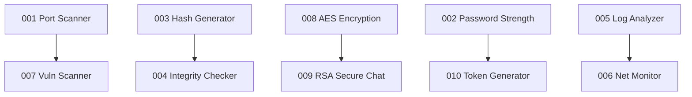

# 🧰 CyberSecurity Tooling Lab

This laboratory contains standalone Jupyter Notebooks designed to guide you through building **defensive, offensive, and cryptographic tools from scratch** using Python.

---

## 1. Subsystem Learning Map

---

## 2. Laboratory Index

| Tool Name | Difficulty | Key Library | Primary Focus | Link |
|:---|:---:|:---|:---|:---|
| **001 Port Scanner** | ⭐⭐ | `socket` | Network Surface Reconnaissance | [Open](001_Port_Scanner.ipynb) |
| **002 Password Strength Analyzer** | ⭐ | `re`, `math` | Checking Entropy Calculations | [Open](002_Password_Strength_Analyzer.ipynb) |
| **003 Hash Generator & Verifier** | ⭐ | `hashlib` | Dynamic Data Fingerprinting | [Open](003_Hash_Generator_and_Verifier.ipynb) |
| **004 File Integrity Checker** | ⭐⭐ | `hashlib`, `os` | Unauthorized System Change Auditing | [Open](004_File_Integrity_Checker.ipynb) |
| **005 Log Analyzer Engine** | ⭐⭐ | `re` | Auditing Bruteforce & Injection Logs | [Open](005_Log_Analyzer_Engine.ipynb) |
| **006 Network Monitor Simulator** | ⭐⭐⭐ | `socket` | Sniffing & Filtering Raw Packet Formats | [Open](006_Network_Monitor_Simulator.ipynb) |
| **007 Vulnerability Scanner Simulator** | ⭐⭐ | `socket`, `json` | Non-intrusive Banner Auditing | [Open](007_Vulnerability_Scanner_Simulator.ipynb) |
| **008 Encryption/Decryption Toolkit** | ⭐⭐⭐ | `cryptography` | AES-256 Symmetric Stream Locking | [Open](008_Encryption_Decryption_Toolkit.ipynb) |
| **009 Secure Chat Simulator** | ⭐⭐⭐⭐ | `socket`, `cryptography` | RSA+AES Ephemeral Channel Chat | [Open](009_Secure_Chat_Simulator.ipynb) |
| **010 Token Generator System** | ⭐⭐⭐ | `secrets`, `hmac` | Secure Authentication Tokens | [Open](010_Token_Generator_System.ipynb) |

---

## 3. Recommended Lab Environment
- **Python Version**: Python 3.12+
- **Prerequisites libraries**: `cryptography` (for cryptographic engineering tasks)
- **Execution Rule**: Run each notebook in single-cell steps, inspecting variables and prints dynamically.
