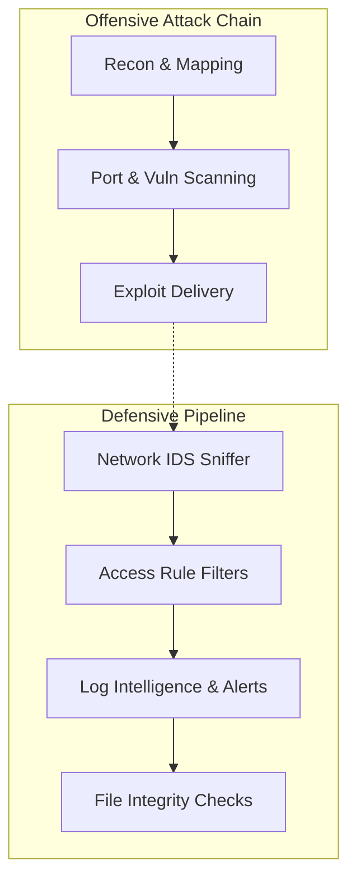
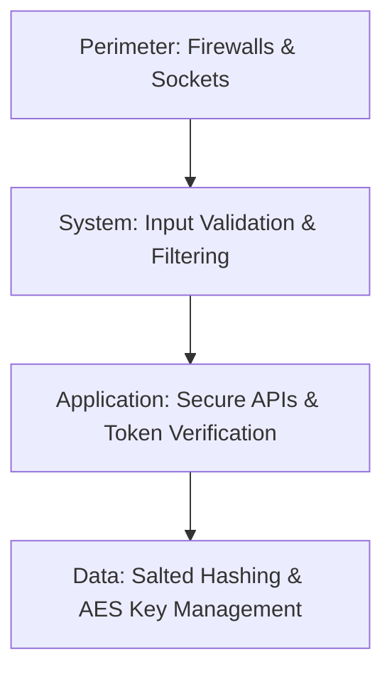

# 🔐 CyberSecurity OS: Python Security Knowledge System

```
========================================================================================
 ██████╗██╗   ██╗██████╗ ███████╗██████╗     ██████╗███████╗ ██████╗ 
██╔════╝╚██╗ ██╔╝██╔══██╗██╔════╝██╔══██╗   ██╔════╝██╔════╝██╔═══██╗
██║      ╚████╔╝ ██████╔╝█████╗  ██████╔╝   ╚█████╗ ███████╗██║   ██║
██║       ╚██╔╝  ██╔══██╗██╔══╝  ██╔══██╗    ╚═══██╗╚════██║██║   ██║
╚██████╗   ██║   ██████╔╝███████╗██║  ██║   ██████╔╝███████║╚██████╔╝
 ╚═════╝   ╚═╝   ╚═════╝ ╚══════╝╚═╝  ╚═╝   ╚═════╝ ╚══════╝ ╚═════╝ 
========================================================================================
```

Welcome to the **CyberSecurity OS** module! This subsystem is a Python-powered learning hub and practical lab containing standalone Jupyter Notebooks designed to guide you through ethical hacking, offensive attack simulations, and enterprise defensive engineering.

---

## ⚠️ ETHICAL HACKING DISCLAIMER
> [!IMPORTANT]
> The content, code snippets, tools, and attack simulations provided in this folder are **strictly for educational purposes, security research, and vulnerability mitigation mapping**. 
> Running unauthorized penetration tests against external servers or devices without explicit written owner consent is illegal and punishable under cybersecurity laws worldwide. 

---

## 1. Security Architecture Models

### A. Attack Kill Chain vs. Defense Pipeline


### B. Enterprise Security Layers Model


---

## 2. Directory Structure

```
CyberSecurity_OS/
├── README.md                          # Subsystem navigation dashboard
└── CYBERSECURITY_TOOLING_LAB/         # Clickable Lab Tooling (001-010)
    ├── README.md                      # Lab Guide and Roadmap
    ├── 001_Port_Scanner.ipynb
    └── ...
```

---

## 3. Subsystem Roadmap & Topic Index

### 📁 CYBERSECURITY_TOOLING_LAB/ (Milestone 1)

| Notebook | Topic | Difficulty | Prerequisite | Link |
|:---|:---|:---:|:---|:---|
| **001** | Python Port Scanner | ⭐⭐ | Socket API | [Open](CYBERSECURITY_TOOLING_LAB/001_Port_Scanner.ipynb) |
| **002** | Password Strength Analyzer | ⭐ | None | [Open](CYBERSECURITY_TOOLING_LAB/002_Password_Strength_Analyzer.ipynb) |
| **003** | Hash Generator & Verifier | ⭐ | None | [Open](CYBERSECURITY_TOOLING_LAB/003_Hash_Generator_and_Verifier.ipynb) |
| **004** | File Integrity Checker | ⭐⭐ | Hash Verification | [Open](CYBERSECURITY_TOOLING_LAB/004_File_Integrity_Checker.ipynb) |
| **005** | Log Analyzer Engine | ⭐⭐ | Regex patterns | [Open](CYBERSECURITY_TOOLING_LAB/005_Log_Analyzer_Engine.ipynb) |
| **006** | Network Monitor Simulator | ⭐⭐⭐ | Socket API, Packets | [Open](CYBERSECURITY_TOOLING_LAB/006_Network_Monitor_Simulator.ipynb) |
| **007** | Vulnerability Scanner Simulator | ⭐⭐ | Port Scanner | [Open](CYBERSECURITY_TOOLING_LAB/007_Vulnerability_Scanner_Simulator.ipynb) |
| **008** | Encryption/Decryption Toolkit | ⭐⭐⭐ | PyCryptodome AES | [Open](CYBERSECURITY_TOOLING_LAB/008_Encryption_Decryption_Toolkit.ipynb) |
| **009** | Secure Chat Simulator | ⭐⭐⭐⭐ | RSA/AES, Sockets | [Open](CYBERSECURITY_TOOLING_LAB/009_Secure_Chat_Simulator.ipynb) |
| **010** | Token Generator System | ⭐⭐⭐ | Cryptography | [Open](CYBERSECURITY_TOOLING_LAB/010_Token_Generator_System.ipynb) |

---

## 4. Role-based Study Tracks

<details>
<summary><b>🛡️ Track A: Defensive Security Engineer (Blue Team)</b></summary>

Focuses on auditing, logging, file monitoring, and token security.
- **Study order**: Topics 002 -> 003 -> 004 -> 005 -> 010.
- **Goal**: Secure system configurations and automate log audits.
</details>

<details>
<summary><b>⚔️ Track B: Offensive Security Analyst (Red Team)</b></summary>

Focuses on port mapping, version auditing, and communication sniffing.
- **Study order**: Topics 001 -> 007 -> 006 -> 009.
- **Goal**: Identify open channels, inspect banners, and map target surfaces.
</details>
