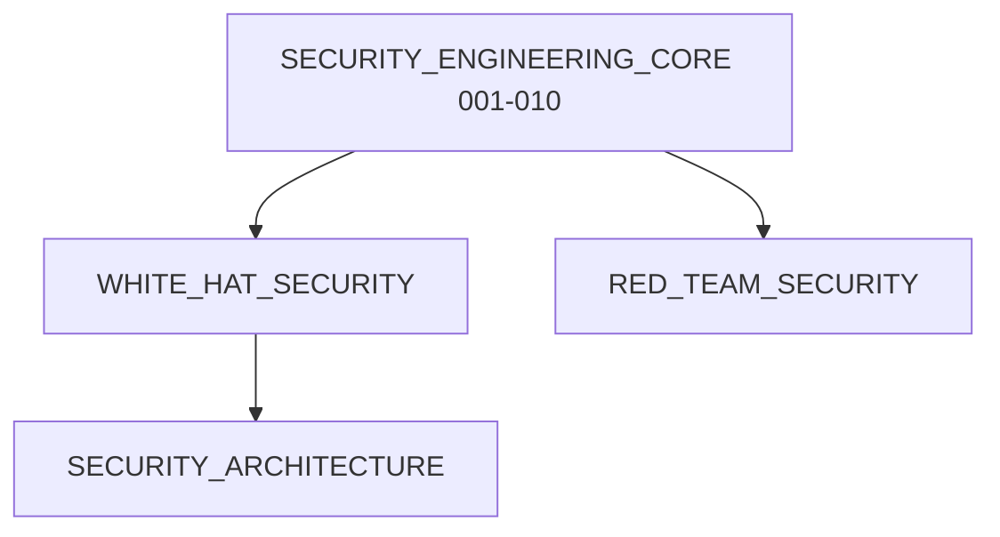

# 🔐 CyberSecurity Python: Modular Knowledge System

Welcome to the **CyberSecurity Python** ecosystem! This directory represents a complete modular repository containing standalone Jupyter Notebooks covering defensive security, offensive simulations, cryptographic architectures, cloud systems auditing, threat hunting, malware forensics, and AI defense mechanics.

---

## 1. Subsystem Learning Graph


---

## 2. Directory Structure
```
CyberSecurity_Python/
├── README.md                          # Central ecosystem index
└── SECURITY_ENGINEERING_CORE/         # Python Secure Engineering (001-010)
    ├── README.md                      # Core Guide and Roadmap
    ├── 001_Secure_Coding_Principles.ipynb
    └── ...
```

---

## 3. Subsystem Index

### 📁 SECURITY_ENGINEERING_CORE/ (Milestone 1)

| Notebook | Topic | Difficulty | Prerequisite | Link |
|:---|:---|:---:|:---|:---|
| **001** | Secure Coding Principles | ⭐ | None | [Open](SECURITY_ENGINEERING_CORE/001_Secure_Coding_Principles.ipynb) |
| **002** | Injection Prevention: SQL | ⭐⭐ | 001 | [Open](SECURITY_ENGINEERING_CORE/002_Injection_Prevention_SQL.ipynb) |
| **003** | Injection Prevention: Command | ⭐⭐ | 001 | [Open](SECURITY_ENGINEERING_CORE/003_Injection_Prevention_Command.ipynb) |
| **004** | Injection Prevention: XSS | ⭐⭐ | 001 | [Open](SECURITY_ENGINEERING_CORE/004_Injection_Prevention_XSS.ipynb) |
| **005** | Safe Eval/Exec Alternatives | ⭐⭐ | 001 | [Open](SECURITY_ENGINEERING_CORE/005_Safe_Eval_Exec_Alternatives.ipynb) |
| **006** | Secure Serialization | ⭐⭐⭐ | 001 | [Open](SECURITY_ENGINEERING_CORE/006_Secure_Serialization.ipynb) |
| **007** | Secure File Handling | ⭐⭐ | 001 | [Open](SECURITY_ENGINEERING_CORE/007_Secure_File_Handling.ipynb) |
| **008** | Secrets Management | ⭐ | None | [Open](SECURITY_ENGINEERING_CORE/008_Secrets_Management.ipynb) |
| **009** | Logging Security Architecture | ⭐⭐ | 001 | [Open](SECURITY_ENGINEERING_CORE/009_Logging_Security_Architecture.ipynb) |
| **010** | Error Handling Security | ⭐⭐ | 001 | [Open](SECURITY_ENGINEERING_CORE/010_Error_Handling_Security.ipynb) |
