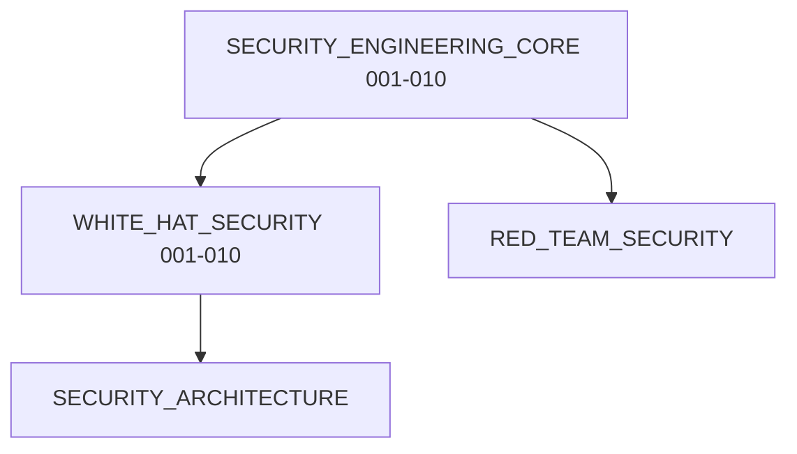

# 🔐 CyberSecurity Python: Modular Knowledge System

Welcome to the **CyberSecurity Python** ecosystem! This directory represents a complete modular repository containing standalone Jupyter Notebooks covering defensive security, offensive simulations, cryptographic architectures, cloud systems auditing, threat hunting, malware forensics, and AI defense mechanics.

---

## 1. Subsystem Learning Graph


---

## 2. Directory Structure
```
CyberSecurity_Python/
├── README.md                          # Central ecosystem index
├── SECURITY_ENGINEERING_CORE/         # Python Secure Engineering (001-010)
│   ├── README.md
│   ├── 001_Secure_Coding_Principles.ipynb
│   └── ...
└── WHITE_HAT_SECURITY/               # Defensive Security Engineering (001-010)
    ├── README.md
    ├── 001_Cyber_Security_Fundamentals.ipynb
    └── ...
```

---

## 3. Subsystem Index

### 📁 SECURITY_ENGINEERING_CORE/ (Milestone 1)

| Notebook | Topic | Difficulty | Prerequisite | Link |
|:---|:---|:---:|:---|:---|
| **001** | Secure Coding Principles | ⭐ | None | [Open](SECURITY_ENGINEERING_CORE/001_Secure_Coding_Principles.ipynb) |
| **002** | Injection Prevention: SQL | ⭐⭐ | 001 | [Open](SECURITY_ENGINEERING_CORE/002_Injection_Prevention_SQL.ipynb) |
| **003** | Injection Prevention: Command | ⭐⭐ | 001 | [Open](SECURITY_ENGINEERING_CORE/003_Injection_Prevention_Command.ipynb) |
| **004** | Injection Prevention: XSS | ⭐⭐ | 001 | [Open](SECURITY_ENGINEERING_CORE/004_Injection_Prevention_XSS.ipynb) |
| **005** | Safe Eval/Exec Alternatives | ⭐⭐ | 001 | [Open](SECURITY_ENGINEERING_CORE/005_Safe_Eval_Exec_Alternatives.ipynb) |
| **006** | Secure Serialization | ⭐⭐⭐ | 001 | [Open](SECURITY_ENGINEERING_CORE/006_Secure_Serialization.ipynb) |
| **007** | Secure File Handling | ⭐⭐ | 001 | [Open](SECURITY_ENGINEERING_CORE/007_Secure_File_Handling.ipynb) |
| **008** | Secrets Management | ⭐ | None | [Open](SECURITY_ENGINEERING_CORE/008_Secrets_Management.ipynb) |
| **009** | Logging Security Architecture | ⭐⭐ | 001 | [Open](SECURITY_ENGINEERING_CORE/009_Logging_Security_Architecture.ipynb) |
| **010** | Error Handling Security | ⭐⭐ | 001 | [Open](SECURITY_ENGINEERING_CORE/010_Error_Handling_Security.ipynb) |

---

### 🛡️ WHITE_HAT_SECURITY/ (Milestone 2)

| Notebook | Topic | Difficulty | Prerequisite | Link |
|:---|:---|:---:|:---|:---|
| **001** | Cyber Security Fundamentals | ⭐ | None | [Open](WHITE_HAT_SECURITY/001_Cyber_Security_Fundamentals.ipynb) |
| **002** | Identity Access Management | ⭐⭐ | 001 | [Open](WHITE_HAT_SECURITY/002_Identity_Access_Management.ipynb) |
| **003** | Authentication Systems | ⭐⭐ | 001 | [Open](WHITE_HAT_SECURITY/003_Authentication_Systems.ipynb) |
| **004** | Cryptographic Defense Engineering | ⭐⭐⭐ | 003 | [Open](WHITE_HAT_SECURITY/004_Cryptographic_Defense_Engineering.ipynb) |
| **005** | Secure API Engineering | ⭐⭐⭐ | 002 | [Open](WHITE_HAT_SECURITY/005_Secure_API_Engineering.ipynb) |
| **006** | OWASP Top 10 Defense | ⭐⭐⭐ | 001 | [Open](WHITE_HAT_SECURITY/006_OWASP_Top_10_Defense.ipynb) |
| **007** | SQL Injection Prevention | ⭐⭐ | 006 | [Open](WHITE_HAT_SECURITY/007_SQL_Injection_Prevention.ipynb) |
| **008** | XSS & CSRF Defense Architecture | ⭐⭐ | 006 | [Open](WHITE_HAT_SECURITY/008_XSS_CSRF_Defense_Architecture.ipynb) |
| **009** | Session Security Systems | ⭐⭐⭐ | 003 | [Open](WHITE_HAT_SECURITY/009_Session_Security_Systems.ipynb) |
| **010** | TLS/SSL Internal Mechanisms | ⭐⭐⭐ | 004 | [Open](WHITE_HAT_SECURITY/010_TLS_SSL_Internal_Mechanisms.ipynb) |
