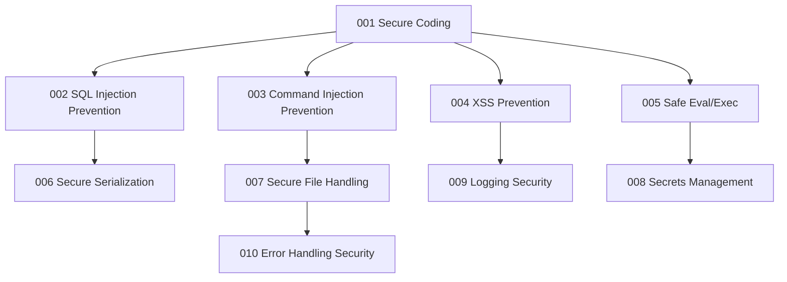

# 🧪 Security Engineering Core

This directory contains standalone Jupyter Notebooks designed to guide you through building **secure, injection-resistant, and memory-safe applications** in Python.

---

## 1. Subsystem Learning Map

---

## 2. Topic Index

| Notebook | Topic | Difficulty | Key Library | Primary Focus | Link |
|:---|:---:|:---|:---|:---|:---|
| **001** | Secure Coding Principles | ⭐ | Standard Library | Defensive validation & white-listing | [Open](001_Secure_Coding_Principles.ipynb) |
| **002** | Injection Prevention: SQL | ⭐⭐ | `sqlite3` | Parameterized prepared statements | [Open](002_Injection_Prevention_SQL.ipynb) |
| **003** | Injection Prevention: Command | ⭐⭐ | `subprocess` | Execution constraints & shell=False | [Open](003_Injection_Prevention_Command.ipynb) |
| **004** | Injection Prevention: XSS | ⭐⭐ | `html` | HTML entity encoding and escaping | [Open](004_Injection_Prevention_XSS.ipynb) |
| **005** | Safe Eval/Exec Alternatives | ⭐⭐ | `ast` | Safe evaluation of literal values | [Open](005_Safe_Eval_Exec_Alternatives.ipynb) |
| **006** | Secure Serialization | ⭐⭐⭐ | `json`, `pickle` | Preventing arbitrary code execution | [Open](006_Secure_Serialization.ipynb) |
| **007** | Secure File Handling | ⭐⭐ | `os`, `pathlib` | Mitigating directory traversals (../) | [Open](007_Secure_File_Handling.ipynb) |
| **008** | Secrets Management | ⭐ | `os`, `dotenv` | Environment separation & loading | [Open](008_Secrets_Management.ipynb) |
| **009** | Logging Security Architecture | ⭐⭐ | `logging` | Log forging protection & masking | [Open](009_Logging_Security_Architecture.ipynb) |
| **010** | Error Handling Security | ⭐⭐ | Standard Library | Sandbox tracebacks & user alerts | [Open](010_Error_Handling_Security.ipynb) |
