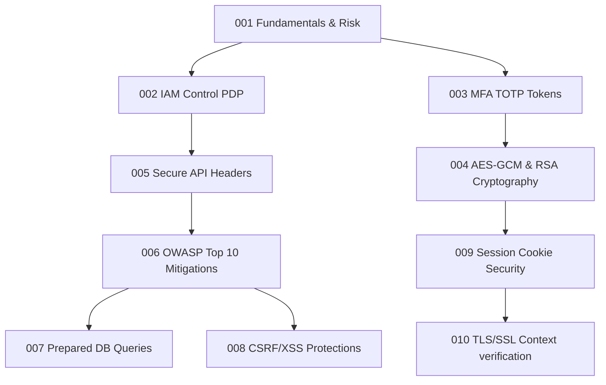

# 🛡️ White Hat Security: Defensive Systems Engineering

This directory contains standalone Jupyter Notebooks designed to guide you through building **enterprise-grade defensive security systems, protection models, and zero-trust credentials validations** using Python.

---

## 1. Subsystem Learning Map

---

## 2. Laboratory Index

| Notebook | Topic | Difficulty | Key Library | Primary Focus | Link |
|:---|:---:|:---|:---|:---|:---|
| **001** | Cyber Security Fundamentals | ⭐ | Standard Library | CIA, AAA models & quantitative risk calculations | [Open](001_Cyber_Security_Fundamentals.ipynb) |
| **002** | Identity Access Management | ⭐⭐ | Standard Library | RBAC vs ABAC policy decision PDP engine | [Open](002_Identity_Access_Management.ipynb) |
| **003** | Authentication Systems | ⭐⭐ | `hmac`, `hashlib` | Time-based OTP (TOTP) RFC 6238 generation | [Open](003_Authentication_Systems.ipynb) |
| **004** | Cryptographic Defense Engineering | ⭐⭐⭐ | `cryptography` | Authenticated ciphers, key validation | [Open](004_Cryptographic_Defense_Engineering.ipynb) |
| **005** | Secure API Engineering | ⭐⭐⭐ | `urllib` | CORS controls, rate-limiting, and headers (HSTS/CSP) | [Open](005_Secure_API_Engineering.ipynb) |
| **006** | OWASP Top 10 Defense | ⭐⭐⭐ | Standard Library | Mapped defensive patterns to prevent major vulnerabilities | [Open](006_OWASP_Top_10_Defense.ipynb) |
| **007** | SQL Injection Prevention | ⭐⭐ | `sqlite3` | Blind SQLi defense structures | [Open](007_SQL_Injection_Prevention.ipynb) |
| **008** | XSS & CSRF Defense Architecture | ⭐⭐ | `html` | CSRF cookie token authentication | [Open](008_XSS_CSRF_Defense_Architecture.ipynb) |
| **009** | Session Security Systems | ⭐⭐⭐ | `secrets`, `hmac` | Secure session cookie configurations | [Open](009_Session_Security_Systems.ipynb) |
| **010** | TLS/SSL Internal Mechanisms | ⭐⭐⭐ | `ssl`, `socket` | Socket context validations and handshakes | [Open](010_TLS_SSL_Internal_Mechanisms.ipynb) |
