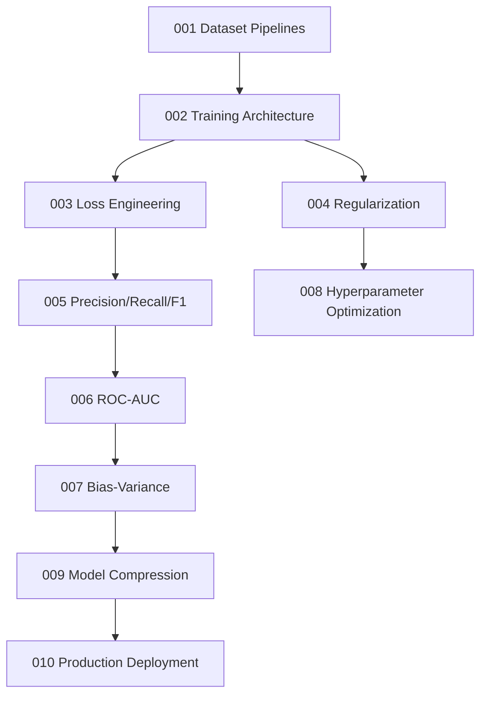

# ⚙️ AI Engineering Systems

Production-grade ML engineering: dataset pipelines, loss engineering, evaluation metrics, hyperparameter optimization, model compression, and deployment.

---

## Learning Map

---

## Notebook Index

| # | Topic | Depth | Link |
|:--|:--|:--:|:--|
| 001 | Dataset Pipeline Engineering | ⭐⭐ | [Open](001_Dataset_Pipeline_Engineering.ipynb) |
| 002 | Training Pipeline Architecture | ⭐⭐⭐ | [Open](002_Training_Pipeline_Architecture.ipynb) |
| 003 | Loss Function Engineering | ⭐⭐⭐⭐ | [Open](003_Loss_Function_Engineering.ipynb) |
| 004 | Regularization Strategies | ⭐⭐⭐ | [Open](004_Regularization_Strategies.ipynb) |
| 005 | Precision Recall and F1 | ⭐⭐⭐ | [Open](005_Precision_Recall_and_F1.ipynb) |
| 006 | ROC AUC Theory | ⭐⭐⭐⭐ | [Open](006_ROC_AUC_Theory.ipynb) |
| 007 | Bias Variance Decomposition | ⭐⭐⭐⭐ | [Open](007_Bias_Variance_Decomposition.ipynb) |
| 008 | Hyperparameter Optimization | ⭐⭐⭐ | [Open](008_Hyperparameter_Optimization.ipynb) |
| 009 | Model Compression and Quantization | ⭐⭐⭐⭐ | [Open](009_Model_Compression_and_Quantization.ipynb) |
| 010 | Production Deployment Systems | ⭐⭐⭐⭐⭐ | [Open](010_Production_Deployment_Systems.ipynb) |
