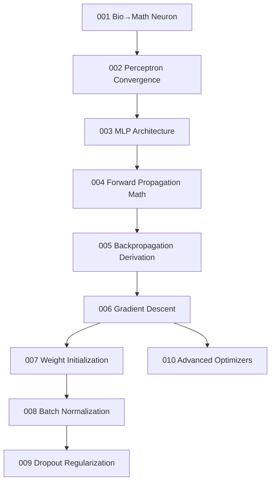

# 🧠 Neural Networks Research Core

A research-grade deep dive into neural network mathematics, from biological neurons through backpropagation derivations to advanced optimizer convergence theory.

---

## Learning Map

---

## Notebook Index

| # | Topic | Depth | Key Math | Link |
|:--|:--|:--:|:--|:--|
| 001 | Biological to Mathematical Neuron | ⭐⭐⭐ | Weighted sum + activation | [Open](001_Biological_to_Mathematical_Neuron.ipynb) |
| 002 | Perceptron and Convergence | ⭐⭐⭐ | Convergence theorem proof | [Open](002_Perceptron_and_Convergence.ipynb) |
| 003 | Multilayer Perceptron Architecture | ⭐⭐⭐ | Universal approximation | [Open](003_Multilayer_Perceptron_Architecture.ipynb) |
| 004 | Forward Propagation Mathematics | ⭐⭐⭐⭐ | Matrix chain Z = WX + b | [Open](004_Forward_Propagation_Mathematics.ipynb) |
| 005 | Backpropagation Derivation | ⭐⭐⭐⭐⭐ | Chain rule on computation graphs | [Open](005_Backpropagation_Derivation.ipynb) |
| 006 | Gradient Descent Optimization | ⭐⭐⭐⭐ | Loss surface geometry | [Open](006_Gradient_Descent_Optimization.ipynb) |
| 007 | Weight Initialization Theory | ⭐⭐⭐ | Xavier / He variance derivation | [Open](007_Weight_Initialization_Theory.ipynb) |
| 008 | Batch Normalization | ⭐⭐⭐⭐ | Internal covariate shift math | [Open](008_Batch_Normalization.ipynb) |
| 009 | Dropout Regularization | ⭐⭐⭐ | Bernoulli masking ensemble | [Open](009_Dropout_Regularization.ipynb) |
| 010 | Advanced Optimizers | ⭐⭐⭐⭐⭐ | Adam bias correction derivation | [Open](010_Advanced_Optimizers.ipynb) |
