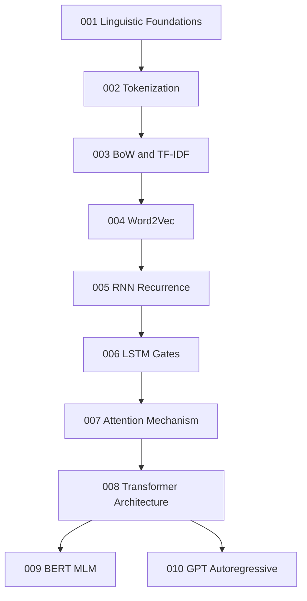

# 🗣️ NLP Research Core

A research-grade deep dive into Natural Language Processing, from linguistic foundations through word embeddings to Transformer architectures.

---

## Learning Map

---

## Notebook Index

| # | Topic | Depth | Key Math | Link |
|:--|:--|:--:|:--|:--|
| 001 | Linguistic Foundations | ⭐⭐ | Language probability models | [Open](001_Linguistic_Foundations.ipynb) |
| 002 | Tokenization Systems | ⭐⭐⭐ | BPE merge algorithm | [Open](002_Tokenization_Systems.ipynb) |
| 003 | Bag of Words and TF-IDF | ⭐⭐⭐ | IDF information theory | [Open](003_Bag_of_Words_and_TFIDF.ipynb) |
| 004 | Word2Vec Embeddings | ⭐⭐⭐⭐ | Skip-gram negative sampling | [Open](004_Word2Vec_Embeddings.ipynb) |
| 005 | RNN Mathematical Recurrence | ⭐⭐⭐⭐ | Hidden state recurrence | [Open](005_RNN_Mathematical_Recurrence.ipynb) |
| 006 | LSTM Gate Equations | ⭐⭐⭐⭐⭐ | Forget/input/output gates | [Open](006_LSTM_Gate_Equations.ipynb) |
| 007 | Attention Mechanism | ⭐⭐⭐⭐⭐ | Scaled dot-product attention | [Open](007_Attention_Mechanism.ipynb) |
| 008 | Transformer Architecture | ⭐⭐⭐⭐⭐ | Multi-head Q-K-V decomposition | [Open](008_Transformer_Architecture.ipynb) |
| 009 | BERT Masked Language Modeling | ⭐⭐⭐⭐ | Bidirectional MLM objective | [Open](009_BERT_Masked_Language_Modeling.ipynb) |
| 010 | GPT Autoregressive Modeling | ⭐⭐⭐⭐⭐ | Causal attention masking | [Open](010_GPT_Autoregressive_Modeling.ipynb) |
