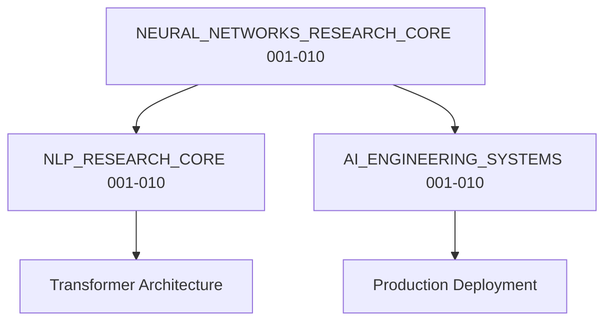

# 🧠 DeepLearning AI: Research Operating System

Welcome to the **Deep Learning + NLP + AI Research Laboratory**. This directory is a world-class, research-grade knowledge system built entirely in Jupyter Notebooks, covering neural network mathematics, NLP transformer engineering, and production AI systems.

---

## 1. Research Domain Map



---

## 2. Directory Structure
```
DeepLearning_AI/
├── README.md
├── NEURAL_NETWORKS_RESEARCH_CORE/
│   ├── README.md
│   ├── 001_Biological_to_Mathematical_Neuron.ipynb
│   └── ...
├── NLP_RESEARCH_CORE/
│   ├── README.md
│   ├── 001_Linguistic_Foundations.ipynb
│   └── ...
└── AI_ENGINEERING_SYSTEMS/
    ├── README.md
    ├── 001_Dataset_Pipeline_Engineering.ipynb
    └── ...
```

---

## 3. Career Progression Path

```
Beginner → ML Engineer → NLP Engineer → AI Researcher → AI System Architect
```

---

## 4. Subsystem Index

### 🧠 NEURAL_NETWORKS_RESEARCH_CORE/

| # | Topic | Depth | Link |
|:--|:--|:--:|:--|
| 001 | Biological to Mathematical Neuron | ⭐⭐⭐ | [Open](NEURAL_NETWORKS_RESEARCH_CORE/001_Biological_to_Mathematical_Neuron.ipynb) |
| 002 | Perceptron and Convergence | ⭐⭐⭐ | [Open](NEURAL_NETWORKS_RESEARCH_CORE/002_Perceptron_and_Convergence.ipynb) |
| 003 | Multilayer Perceptron Architecture | ⭐⭐⭐ | [Open](NEURAL_NETWORKS_RESEARCH_CORE/003_Multilayer_Perceptron_Architecture.ipynb) |
| 004 | Forward Propagation Mathematics | ⭐⭐⭐⭐ | [Open](NEURAL_NETWORKS_RESEARCH_CORE/004_Forward_Propagation_Mathematics.ipynb) |
| 005 | Backpropagation Derivation | ⭐⭐⭐⭐⭐ | [Open](NEURAL_NETWORKS_RESEARCH_CORE/005_Backpropagation_Derivation.ipynb) |
| 006 | Gradient Descent Optimization | ⭐⭐⭐⭐ | [Open](NEURAL_NETWORKS_RESEARCH_CORE/006_Gradient_Descent_Optimization.ipynb) |
| 007 | Weight Initialization Theory | ⭐⭐⭐ | [Open](NEURAL_NETWORKS_RESEARCH_CORE/007_Weight_Initialization_Theory.ipynb) |
| 008 | Batch Normalization | ⭐⭐⭐⭐ | [Open](NEURAL_NETWORKS_RESEARCH_CORE/008_Batch_Normalization.ipynb) |
| 009 | Dropout Regularization | ⭐⭐⭐ | [Open](NEURAL_NETWORKS_RESEARCH_CORE/009_Dropout_Regularization.ipynb) |
| 010 | Advanced Optimizers | ⭐⭐⭐⭐⭐ | [Open](NEURAL_NETWORKS_RESEARCH_CORE/010_Advanced_Optimizers.ipynb) |

---

### 🗣️ NLP_RESEARCH_CORE/

| # | Topic | Depth | Link |
|:--|:--|:--:|:--|
| 001 | Linguistic Foundations | ⭐⭐ | [Open](NLP_RESEARCH_CORE/001_Linguistic_Foundations.ipynb) |
| 002 | Tokenization Systems | ⭐⭐⭐ | [Open](NLP_RESEARCH_CORE/002_Tokenization_Systems.ipynb) |
| 003 | Bag of Words and TF-IDF | ⭐⭐⭐ | [Open](NLP_RESEARCH_CORE/003_Bag_of_Words_and_TFIDF.ipynb) |
| 004 | Word2Vec Embeddings | ⭐⭐⭐⭐ | [Open](NLP_RESEARCH_CORE/004_Word2Vec_Embeddings.ipynb) |
| 005 | RNN Mathematical Recurrence | ⭐⭐⭐⭐ | [Open](NLP_RESEARCH_CORE/005_RNN_Mathematical_Recurrence.ipynb) |
| 006 | LSTM Gate Equations | ⭐⭐⭐⭐⭐ | [Open](NLP_RESEARCH_CORE/006_LSTM_Gate_Equations.ipynb) |
| 007 | Attention Mechanism | ⭐⭐⭐⭐⭐ | [Open](NLP_RESEARCH_CORE/007_Attention_Mechanism.ipynb) |
| 008 | Transformer Architecture | ⭐⭐⭐⭐⭐ | [Open](NLP_RESEARCH_CORE/008_Transformer_Architecture.ipynb) |
| 009 | BERT Masked Language Modeling | ⭐⭐⭐⭐ | [Open](NLP_RESEARCH_CORE/009_BERT_Masked_Language_Modeling.ipynb) |
| 010 | GPT Autoregressive Modeling | ⭐⭐⭐⭐⭐ | [Open](NLP_RESEARCH_CORE/010_GPT_Autoregressive_Modeling.ipynb) |

---

### ⚙️ AI_ENGINEERING_SYSTEMS/

| # | Topic | Depth | Link |
|:--|:--|:--:|:--|
| 001 | Dataset Pipeline Engineering | ⭐⭐ | [Open](AI_ENGINEERING_SYSTEMS/001_Dataset_Pipeline_Engineering.ipynb) |
| 002 | Training Pipeline Architecture | ⭐⭐⭐ | [Open](AI_ENGINEERING_SYSTEMS/002_Training_Pipeline_Architecture.ipynb) |
| 003 | Loss Function Engineering | ⭐⭐⭐⭐ | [Open](AI_ENGINEERING_SYSTEMS/003_Loss_Function_Engineering.ipynb) |
| 004 | Regularization Strategies | ⭐⭐⭐ | [Open](AI_ENGINEERING_SYSTEMS/004_Regularization_Strategies.ipynb) |
| 005 | Precision Recall and F1 | ⭐⭐⭐ | [Open](AI_ENGINEERING_SYSTEMS/005_Precision_Recall_and_F1.ipynb) |
| 006 | ROC AUC Theory | ⭐⭐⭐⭐ | [Open](AI_ENGINEERING_SYSTEMS/006_ROC_AUC_Theory.ipynb) |
| 007 | Bias Variance Decomposition | ⭐⭐⭐⭐ | [Open](AI_ENGINEERING_SYSTEMS/007_Bias_Variance_Decomposition.ipynb) |
| 008 | Hyperparameter Optimization | ⭐⭐⭐ | [Open](AI_ENGINEERING_SYSTEMS/008_Hyperparameter_Optimization.ipynb) |
| 009 | Model Compression and Quantization | ⭐⭐⭐⭐ | [Open](AI_ENGINEERING_SYSTEMS/009_Model_Compression_and_Quantization.ipynb) |
| 010 | Production Deployment Systems | ⭐⭐⭐⭐⭐ | [Open](AI_ENGINEERING_SYSTEMS/010_Production_Deployment_Systems.ipynb) |
