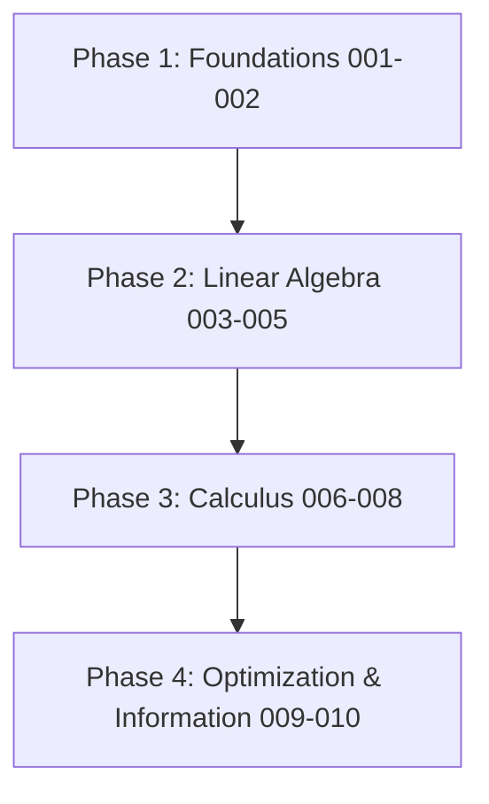
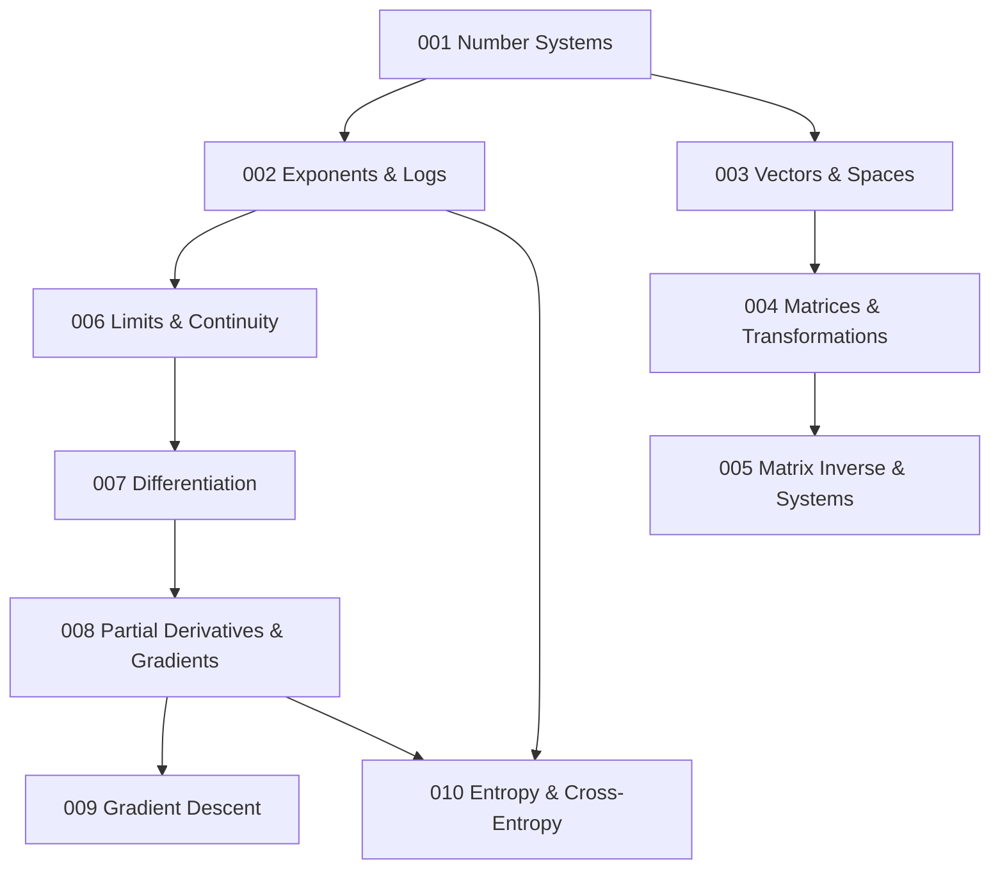

# 📐 Mathematics for Artificial Intelligence

```
========================================================================================
███╗   ███╗ █████╗ ████████╗██╗  ██╗███████╗███╗   ███╗ █████╗ ████████╗██╗ ██████╗███████╗
████╗ ████║██╔══██╗╚══██╔══╝██║  ██║██╔════╝████╗ ████║██╔══██╗╚══██╔══╝██║██╔════╝██╔════╝
██╔████╔██║███████║   ██║   ███████║█████╗  ██╔████╔██║███████║   ██║   ██║██║     ███████╗
██║╚██╔╝██║██╔══██║   ██║   ██╔══██║██╔══╝  ██║╚██╔╝██║██╔══██║   ██║   ██║██║     ╚════██║
██║ ╚═╝ ██║██║  ██║   ██║   ██║  ██║███████╗██║ ╚═╝ ██║██║  ██║   ██║   ██║╚██████╗███████║
╚═╝     ╚═╝╚═╝  ╚═╝   ╚═╝   ╚═╝  ╚═╝╚══════╝╚═╝     ╚═╝╚═╝  ╚═╝   ╚═╝   ╚═╝ ╚═════╝╚══════╝
========================================================================================
```

Welcome to the **Mathematics for Artificial Intelligence** module! This folder contains a comprehensive collection of Jupyter Notebooks mapping out the fundamental mathematical foundations required for modern machine learning, deep learning, optimization, and research-level computer science.

---

## 1. Learning Roadmap



---

## 2. Topic Navigation

| Notebook | Topic | Difficulty | Prerequisite | Link |
|:---|:---|:---:|:---|:---|
| **001** | Number Systems | ⭐ | None | [Open](001_Number_Systems.ipynb) |
| **002** | Exponents & Logarithms | ⭐ | 001 | [Open](002_Exponents_and_Logarithms.ipynb) |
| **003** | Vectors & Vector Spaces | ⭐⭐ | 001 | [Open](003_Vectors_and_Vector_Spaces.ipynb) |
| **004** | Matrices & Linear Transformations | ⭐⭐ | 003 | [Open](004_Matrices_and_Linear_Transformations.ipynb) |
| **005** | Matrix Inverse & Systems | ⭐⭐⭐ | 004 | [Open](005_Matrix_Inverse_and_Systems.ipynb) |
| **006** | Limits & Continuity | ⭐⭐ | 002 | [Open](006_Limits_and_Continuity.ipynb) |
| **007** | Differentiation & Rates of Change | ⭐⭐ | 006 | [Open](007_Differentiation_and_Rates_of_Change.ipynb) |
| **008** | Partial Derivatives & Gradients | ⭐⭐⭐ | 007 | [Open](008_Partial_Derivatives_and_Gradients.ipynb) |
| **009** | Gradient Descent Mathematics | ⭐⭐⭐ | 008 | [Open](009_Gradient_Descent_Mathematics.ipynb) |
| **010** | Entropy & Cross-Entropy | ⭐⭐⭐ | 002, 008 | [Open](010_Entropy_and_Cross_Entropy.ipynb) |

---

## 3. Prerequisite Dependency Graph



---

## 4. Study Schedule & Recommendations

- **Week 1 (Topics 001 - 002)**: Re-establish coordinate basics, float precision math (IEEE 754), and logarithms base scales.
- **Week 2 (Topics 003 - 005)**: Master vector space dot products, coordinate projections, transformation matrix rank, and pseudo-inverses.
- **Week 3 (Topics 006 - 008)**: Deep-dive limits definitions, chain rules, gradients vector math, and Jacobian representations.
- **Week 4 (Topics 009 - 010)**: Focus on optimization convergence proofs, convex analysis, and Information Theory cross-entropy definitions.

---

## 5. Difficulty Scale Badge Legend
- ⭐ **Beginner**: Standard arithmetic, exponents rules, coordinates.
- ⭐⭐ **Intermediate**: Vector additions, limits calculations, simple derivatives.
- ⭐⭐⭐ **Advanced**: Singular matrices, Jacobians, convergence proofs, Shannon entropy.
