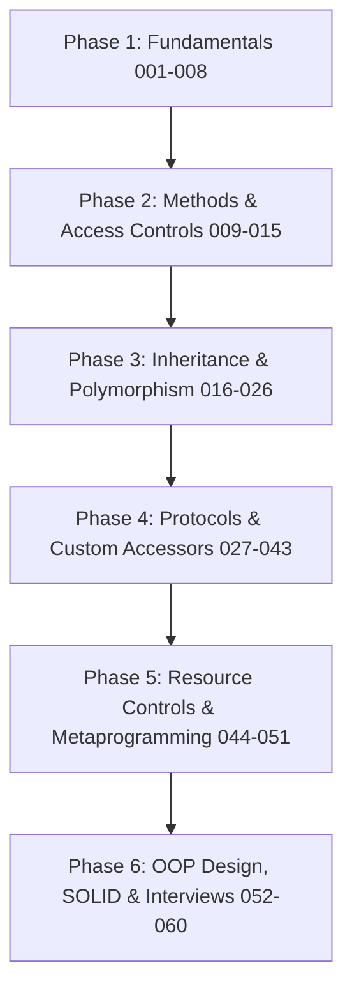
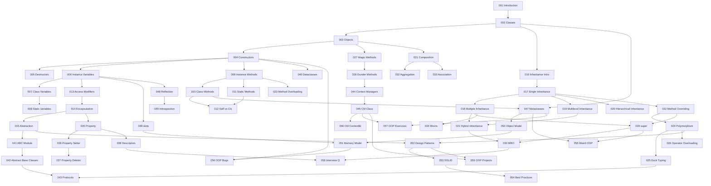

# 🐍 Ultimate Python OOP Master Notebook Collection

```
========================================================================================
████████╗███████╗ ██████╗██╗  ██╗ ██████╗  ██████╗  ██████╗     ███╗   ███╗ █████╗ ███████╗████████╗███████╗██████╗ 
╚══██╔══╝██╔════╝██╔════╝██║  ██║██╔════╝ ██╔═══██╗██╔═══██╗    ████╗ ████║██╔══██╗██╔════╝╚══██╔══╝██╔════╝██╔══██╗
   ██║   █████╗  ██║     ███████║██║      ██║   ██║██║   ██║    ██╔████╔██║███████║███████╗   ██║   █████╗  ██████╔╝
   ██║   ██╔══╝  ██║     ██╔══██║██║      ██║   ██║██║   ██║    ██║╚██╔╝██║██╔══██║╚════██║   ██║   ██╔══╝  ██╔══██╗
   ██║   ███████╗╚██████╗██║  ██║╚██████╗ ╚██████╔╝╚██████╔╝    ██║ ╚═╝ ██║██║  ██║███████║   ██║   ███████╗██║  ██║
   ╚═╝   ╚══════╝ ╚═════╝╚═╝  ╚═╝ ╚═════╝  ╚═════╝  ╚═════╝     ╚═╝     ╚═╝╚═╝  ╚═╝╚══════╝   ╚═╝   ╚══════╝╚═╝  ╚═╝
========================================================================================
```

Welcome to the **Ultimate Python Object-Oriented Programming (OOP) Master Collection**! This is a complete, professional, CPython-contributor-level learning repository containing **60 standalone Jupyter Notebooks** designed to guide you from an absolute beginner to a master-level expert in Python OOP and execution models.

---

## 1. Project Overview

This repository exists to fill the gap between high-level Python tutorials and low-level execution mechanics. Every notebook is fully self-contained, acts as an independent topic class, and teaches concepts deeply using the following curriculum path:

1. **Foundations (001 - 008)**: Anatomy of classes, namespaces, objects, and memory slots.
2. **Methods & Access (009 - 015)**: Bound methods, `@classmethod`, `@staticmethod`, encapsulation, name mangling, and abstraction.
3. **Inheritance & Polymorphism (016 - 026)**: Cooperative multiple inheritance, the C3 Linearization MRO algorithm, and operator overloading.
4. **Protocols & Advanced Access (027 - 043)**: Magic/dunder methods, property accessors, descriptors, slots, and typing Protocols.
5. **Metaprogramming & Internals (044 - 051)**: Context managers, custom metaclasses, reflection, introspection, and CPython heap structures.
6. **Design & Practice (052 - 060)**: SOLID principles, design patterns, exercises, interview questions, projects, and cheat sheets.

---

## 2. Repository Structure

The project files are organized as follows:

```
Ultimate-Python-OOP/
├── README.md                          # Repository Home and Navigation
├── compile_oop.py                     # Python compiler converting sources to notebooks
├── oop_sources/                       # Standalone Python source code files
│   ├── 001_OOP_Introduction.py
│   ├── 002_Classes.py
│   └── ...
└── Python_OOP_Master/                 # Clickable Compiled Jupyter Notebooks (.ipynb)
    ├── 001_OOP_Introduction.ipynb
    ├── 002_Classes.ipynb
    └── ...
```

---

## 3. Learning Roadmap



---

## 4. Navigation Table

| Notebook | Topic | Difficulty | Prerequisite | Link |
|:---|:---|:---:|:---|:---|
| **001** | OOP Introduction | ⭐ | None | [Open](Python_OOP_Master/001_OOP_Introduction.ipynb) |
| **002** | Classes | ⭐ | 001 | [Open](Python_OOP_Master/002_Classes.ipynb) |
| **003** | Objects | ⭐ | 002 | [Open](Python_OOP_Master/003_Objects.ipynb) |
| **004** | Constructors | ⭐ | 003 | [Open](Python_OOP_Master/004_Constructors.ipynb) |
| **005** | Destructors | ⭐ | 004 | [Open](Python_OOP_Master/005_Destructors.ipynb) |
| **006** | Instance Variables | ⭐ | 004 | [Open](Python_OOP_Master/006_Instance_Variables.ipynb) |
| **007** | Class Variables | ⭐ | 006 | [Open](Python_OOP_Master/007_Class_Variables.ipynb) |
| **008** | Static Variables | ⭐ | 007 | [Open](Python_OOP_Master/008_Static_Variables.ipynb) |
| **009** | Instance Methods | ⭐ | 004 | [Open](Python_OOP_Master/009_Instance_Methods.ipynb) |
| **010** | Class Methods | ⭐⭐ | 009 | [Open](Python_OOP_Master/010_Class_Methods.ipynb) |
| **011** | Static Methods | ⭐⭐ | 009 | [Open](Python_OOP_Master/011_Static_Methods.ipynb) |
| **012** | Self vs cls | ⭐ | 010, 011 | [Open](Python_OOP_Master/012_Self_vs_cls.ipynb) |
| **013** | Access Modifiers | ⭐⭐ | 006 | [Open](Python_OOP_Master/013_Access_Modifiers.ipynb) |
| **014** | Encapsulation | ⭐⭐ | 013 | [Open](Python_OOP_Master/014_Encapsulation.ipynb) |
| **015** | Abstraction | ⭐⭐ | 014 | [Open](Python_OOP_Master/015_Abstraction.ipynb) |
| **016** | Inheritance Introduction | ⭐ | 002 | [Open](Python_OOP_Master/016_Inheritance_Introduction.ipynb) |
| **017** | Single Inheritance | ⭐ | 016 | [Open](Python_OOP_Master/017_Single_Inheritance.ipynb) |
| **018** | Multiple Inheritance | ⭐⭐ | 017 | [Open](Python_OOP_Master/018_Multiple_Inheritance.ipynb) |
| **019** | Multilevel Inheritance | ⭐⭐ | 017 | [Open](Python_OOP_Master/019_Multilevel_Inheritance.ipynb) |
| **020** | Hierarchical Inheritance | ⭐⭐ | 017 | [Open](Python_OOP_Master/020_Hierarchical_Inheritance.ipynb) |
| **021** | Hybrid Inheritance | ⭐⭐⭐ | 018, 019 | [Open](Python_OOP_Master/021_Hybrid_Inheritance.ipynb) |
| **022** | Method Overriding | ⭐⭐ | 017 | [Open](Python_OOP_Master/022_Method_Overriding.ipynb) |
| **023** | Method Overloading | ⭐⭐ | 009 | [Open](Python_OOP_Master/023_Method_Overloading.ipynb) |
| **024** | Polymorphism | ⭐⭐ | 022 | [Open](Python_OOP_Master/024_Polymorphism.ipynb) |
| **025** | Duck Typing | ⭐⭐ | 024 | [Open](Python_OOP_Master/025_Duck_Typing.ipynb) |
| **026** | Operator Overloading | ⭐⭐⭐ | 024 | [Open](Python_OOP_Master/026_Operator_Overloading.ipynb) |
| **027** | Magic Methods | ⭐⭐ | 003 | [Open](Python_OOP_Master/027_Magic_Methods.ipynb) |
| **028** | Dunder Methods | ⭐⭐ | 027 | [Open](Python_OOP_Master/028_Dunder_Methods.ipynb) |
| **029** | super() | ⭐⭐⭐ | 018, 022 | [Open](Python_OOP_Master/029_super().ipynb) |
| **030** | MRO | ⭐⭐⭐⭐ | 021, 029 | [Open](Python_OOP_Master/030_MRO.ipynb) |
| **031** | Composition | ⭐⭐ | 003 | [Open](Python_OOP_Master/031_Composition.ipynb) |
| **032** | Aggregation | ⭐⭐ | 031 | [Open](Python_OOP_Master/032_Aggregation.ipynb) |
| **033** | Association | ⭐⭐ | 031 | [Open](Python_OOP_Master/033_Association.ipynb) |
| **034** | Mixins | ⭐⭐⭐ | 018 | [Open](Python_OOP_Master/034_Mixins.ipynb) |
| **035** | Property | ⭐⭐ | 014 | [Open](Python_OOP_Master/035_Property.ipynb) |
| **036** | Property Setter | ⭐⭐ | 035 | [Open](Python_OOP_Master/036_Property_Setter.ipynb) |
| **037** | Property Deleter | ⭐⭐ | 036 | [Open](Python_OOP_Master/037_Property_Deleter.ipynb) |
| **038** | Descriptors | ⭐⭐⭐⭐ | 035 | [Open](Python_OOP_Master/038_Descriptors.ipynb) |
| **039**| slots | ⭐⭐⭐ | 006 | [Open](Python_OOP_Master/039___slots__.ipynb) |
| **040** | Dataclasses | ⭐⭐ | 004 | [Open](Python_OOP_Master/040_Dataclasses.ipynb) |
| **041** | ABC Module | ⭐⭐⭐ | 015 | [Open](Python_OOP_Master/041_ABC_Module.ipynb) |
| **042** | Abstract Base Classes | ⭐⭐⭐ | 041 | [Open](Python_OOP_Master/042_Abstract_Base_Classes.ipynb) |
| **043** | Protocols | ⭐⭐⭐ | 025, 042 | [Open](Python_OOP_Master/043_Protocols.ipynb) |
| **044** | Context Managers | ⭐⭐ | 028 | [Open](Python_OOP_Master/044_Context_Managers.ipynb) |
| **045** | Context Manager Class | ⭐⭐⭐ | 044 | [Open](Python_OOP_Master/045_Context_Manager_Class.ipynb) |
| **046** | Context Manager Contextlib | ⭐⭐⭐ | 045 | [Open](Python_OOP_Master/046_Context_Manager_Contextlib.ipynb) |
| **047** | Metaclasses | ⭐⭐⭐⭐⭐ | 002, 010 | [Open](Python_OOP_Master/047_Metaclasses.ipynb) |
| **048** | Reflection | ⭐⭐⭐ | 006 | [Open](Python_OOP_Master/048_Reflection.ipynb) |
| **049** | Introspection | ⭐⭐⭐ | 048 | [Open](Python_OOP_Master/049_Introspection.ipynb) |
| **050** | Object Model | ⭐⭐⭐⭐⭐ | 047 | [Open](Python_OOP_Master/050_Object_Model.ipynb) |
| **051** | Memory Model | ⭐⭐⭐⭐ | 039, 050 | [Open](Python_OOP_Master/051_Memory_Model.ipynb) |
| **052** | OOP Design Patterns | ⭐⭐⭐ | 015, 024 | [Open](Python_OOP_Master/052_OOP_Design_Patterns.ipynb) |
| **053** | SOLID Principles | ⭐⭐⭐ | 052 | [Open](Python_OOP_Master/053_SOLID_Principles.ipynb) |
| **054** | OOP Best Practices | ⭐⭐ | 053 | [Open](Python_OOP_Master/054_OOP_Best_Practices.ipynb) |
| **055** | Weird OOP | ⭐⭐⭐ | 029, 047 | [Open](Python_OOP_Master/055_Weird_OOP.ipynb) |
| **056** | OOP Bugs | ⭐⭐ | 004, 051 | [Open](Python_OOP_Master/056_OOP_Bugs.ipynb) |
| **057** | OOP Exercises | ⭐⭐ | 045, 047 | [Open](Python_OOP_Master/057_OOP_Exercises.ipynb) |
| **058** | OOP Interview Q | ⭐⭐⭐ | 030, 038 | [Open](Python_OOP_Master/058_OOP_Interview_Q.ipynb) |
| **059** | OOP Projects | ⭐⭐⭐ | 045, 052 | [Open](Python_OOP_Master/059_OOP_Projects.ipynb) |
| **060** | OOP Master CheatSheet | ⭐ | None | [Open](Python_OOP_Master/060_OOP_Master_CheatSheet.ipynb) |

---

## 5. How to Study

* **Follow Sequential Order**: Every notebook builds upon previous concepts. Do NOT skip modules.
* **Observe Prerequisite Requirements**: Ensure you completed the specified prerequisite notebook before advancing.
* **Estimated Study Time**: Spend approximately 1-2 hours per notebook. Run every block, analyze outputs, and solve the coding challenges.
* **Revision Loop**: Review the Cheat Sheet (`060`) weekly to retain terminology.

---

## 6. Notebook Format

Every notebook contains a standardized, comprehensive template:
1. **Curriculum Comment Block**: Contains standard definitions, internal working, memory behavior, advantages/disadvantages, best practices, and common bugs.
2. **Interactive Code Examples**: Executable, line-by-line commented scripts spanning:
   - 💻 *Beginner*: Basic syntax and layout.
   - 💻 *Intermediate*: State modifications and error catches.
   - 💻 *Advanced*: Complex descriptors, meta overrides, or protocol configurations.
3. **FAANG-style Coding Challenges**: Custom coding challenges containing complete, executable solutions.
4. **Interview QA Bank**: Beginner, intermediate, and senior-level interview questions.

---

## 7. Icons & Difficulty Legend

### Difficulty Scale:
* ⭐ **Beginner**: Conceptual introductions, standard variables/classes.
* ⭐⭐ **Intermediate**: Methods, basic inheritance, scoping rules.
* ⭐⭐⭐ **Advanced**: Multiple inheritance, custom decorators, abstract factories.
* ⭐⭐⭐⭐ **Expert**: Descriptors protocol, C3 linearization, slots memory buffers.
* ⭐⭐⭐⭐⭐ **CPython Level**: Metaclasses compilation hooks, PyObject structures.

### Emoji Indicators:
* 📘 **Theory**: Fundamental OOP logic.
* 💻 **Code**: Clean commented scripts.
* 🧠 **Internal Working**: Interpreter actions.
* ⚡ **Performance**: Time and Space optimization.
* 🎯 **Interview**: Target questions.
* 📝 **Exercise**: Coding challenges.
* ✅ **Solution**: Challenge resolutions.

---

## 8. Prerequisite Dependency Graph



---

## 9. How to Open the Notebooks

### 1. VS Code
1. Install Python (>=3.8) and VS Code.
2. Install the **Jupyter** extension from the Extension Marketplace.
3. Open this workspace folder inside VS Code.
4. Click on any `.ipynb` file in the file explorer to open it.
5. Click **Run All** or execute cells sequentially.

### 2. Jupyter Notebook / JupyterLab
1. Install jupyter in your shell:
   ```bash
   pip install jupyter jupyterlab
   ```
2. Launch the server from this workspace directory:
   ```bash
   jupyter notebook
   # OR
   jupyter lab
   ```
3. Navigate to `Python_OOP_Master/` and open your desired notebook.

### 3. Google Colab
1. Navigate to [Google Colab](https://colab.research.google.com).
2. Select the **Upload** tab.
3. Drag and drop any `.ipynb` file from this folder.
4. Run cells sequentially.

---

## 10. Recommended Study Plan & Projects

* **Week 1 (Topics 001 - 015)**: Master classes, namespaces, attributes, methods, and encapsulation.
* **Week 2 (Topics 016 - 030)**: Solve Diamond problem, trace C3 linearization, and overload operators.
* **Week 3 (Topics 031 - 043)**: Integrate composition, build custom descriptors, and implement static typing Protocols.
* **Week 4 (Topics 044 - 060)**: Build context managers, create metaclasses, and compile the **Task Scheduling Project** (`059`).

---

## 11. FAQ

* **Q: Do I need prior Python knowledge?**
  - A: Basic syntax knowledge (loops, variables) is helpful, but no prior OOP experience is required.
* **Q: Can I skip notebooks?**
  - A: Highly discouraged. Later notebooks (like Descriptors or Metaclasses) rely heavily on early concepts (like Attribute Scoping and bound methods).
* **Q: Should I run every code example?**
  - A: Yes. Modifying variables and executing cells will show CPython behaviors dynamically.

---

## 12. Contribution Guide

We welcome improvements and additions!
1. Fork the repository.
2. If adding a new topic source file, save it under `oop_sources/` following naming rules: `061_New_Topic.py`.
3. Run the compiler:
   ```bash
   python compile_oop.py
   ```
4. Update the Navigation Table in this `README.md`.
5. Submit a Pull Request.

---

## 13. License

This project is licensed under the MIT License.

---

## 14. Footer

> "The best way to understand how a complex system works is to build it yourself, instruction by instruction, block by block. Master the foundations, and the rest will follow."
