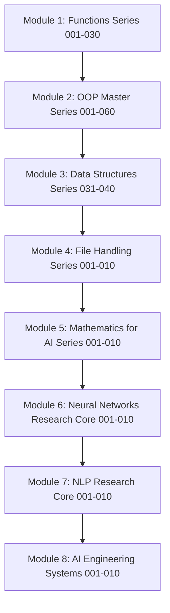

# 🐍 Ultimate Python Master Encyclopedia

```
========================================================================================
██████╗ ██╗   ██╗████████╗██╗  ██╗ ██████╗ ███╗   ██╗    ███████╗███╗   ███╗ ██████╗██╗   ██╗
██╔══██╗╚██╗ ██╔╝╚══██╔══╝██║  ██║██╔═══██╗████╗  ██║    ██╔════╝████╗ ████║██╔════╝╚██╗ ██╔╝
██████╔╝ ╚████╔╝    ██║   ███████║██║   ██║██╔██╗ ██║    █████╗  ██╔████╔██║██║      ╚████╔╝ 
██╔═══╝   ╚██╔╝     ██║   ██╔══██║██║   ██║██║╚██╗██║    ██╔══╝  ██║╚██╔╝██║██║       ╚██╔╝  
██║        ██║      ██║   ██║  ██║╚██████╔╝██║ ╚████║    ███████╗██║ ╚═╝ ██║╚██████╗   ██║   
╚═╝        ╚═╝      ╚═╝   ╚═╝  ╚═╝ ╚═════╝ ╚═╝  ╚═══╝    ╚══════╝╚═╝     ╚═╝ ╚═════╝   ╚═╝   
========================================================================================
```

Welcome to the **Ultimate Python Master Encyclopedia**! This is a complete, production-quality, CPython-contributor-level learning repository containing standalone Jupyter Notebooks designed to guide you from an absolute beginner to a master-level expert in Python programming, software design, memory allocation, and execution models.

---

## 1. Project Curriculum Path

The encyclopedia is organized into three major modules completed so far:



---

## 2. Directory Structure

The project files are organized as follows:

```
Complete-Python-3-oops-also/
├── README.md                          # Repository Unified Home and Index
├── Python_Functions_Master/           # Module 1: Clickable Functions Notebooks (001-030)
│   ├── 001_Functions_Introduction.ipynb
│   └── ...
├── Python_OOP_Master/                 # Module 2: Clickable OOP Notebooks (001-060)
│   ├── 001_OOP_Introduction.ipynb
│   └── ...
├── Python_DataStructures_Master/      # Module 3: Clickable Data Structures Notebooks (031-040)
│   ├── 031_Arrays.ipynb
│   └── ...
├── Mathematics_for_AI/                # Module 5: Clickable Mathematics Notebooks (001-010)
│   ├── 001_Number_Systems.ipynb
│   └── ...
└── DeepLearning_AI/                   # Modules 6-8: Deep Learning & NLP Research Core (001-010)
    ├── NEURAL_NETWORKS_RESEARCH_CORE/
    │   ├── 001_Biological_to_Mathematical_Neuron.ipynb
    │   └── ...
    ├── NLP_RESEARCH_CORE/
    │   ├── 001_Linguistic_Foundations.ipynb
    │   └── ...
    └── AI_ENGINEERING_SYSTEMS/
        ├── 001_Dataset_Pipeline_Engineering.ipynb
        └── ...
```

---

## 3. Module 1: Python Functions Series (001 - 030)

| Notebook | Topic | Difficulty | Prerequisite | Link |
|:---|:---|:---:|:---|:---|
| **001** | Functions Introduction | ⭐ | None | [Open](Python_Functions_Master/001_Functions_Introduction.ipynb) |
| **002** | Function Definition | ⭐ | 001 | [Open](Python_Functions_Master/002_Function_Definition.ipynb) |
| **003** | Function Arguments | ⭐ | 002 | [Open](Python_Functions_Master/003_Function_Arguments.ipynb) |
| **004** | Default Arguments | ⭐ | 003 | [Open](Python_Functions_Master/004_Default_Arguments.ipynb) |
| **005** | Keyword Arguments | ⭐ | 003 | [Open](Python_Functions_Master/005_Keyword_Arguments.ipynb) |
| **006** | Positional Arguments | ⭐ | 003 | [Open](Python_Functions_Master/006_Positional_Arguments.ipynb) |
| **007** | Positional-Only Arguments | ⭐⭐ | 006 | [Open](Python_Functions_Master/007_Positional_Only_Arguments.ipynb) |
| **008** | Keyword-Only Arguments | ⭐⭐ | 005 | [Open](Python_Functions_Master/008_Keyword_Only_Arguments.ipynb) |
| **009** | args packing | ⭐ | 006 | [Open](Python_Functions_Master/009_args.ipynb) |
| **010** | kwargs packing | ⭐ | 005 | [Open](Python_Functions_Master/010_kwargs.ipynb) |
| **011** | Return Statement | ⭐ | 002 | [Open](Python_Functions_Master/011_Return_Statement.ipynb) |
| **012** | Scope | ⭐⭐ | 002 | [Open](Python_Functions_Master/012_Scope.ipynb) |
| **013** | LEGB Rule | ⭐⭐ | 012 | [Open](Python_Functions_Master/013_LEGB_Rule.ipynb) |
| **014** | Recursion | ⭐⭐⭐ | 002, 011 | [Open](Python_Functions_Master/014_Recursion.ipynb) |
| **015** | Lambda Functions | ⭐⭐ | 002 | [Open](Python_Functions_Master/015_Lambda_Functions.ipynb) |
| **016** | Map, Filter, Reduce | ⭐⭐ | 015 | [Open](Python_Functions_Master/016_Map_Filter_Reduce.ipynb) |
| **017** | Closures | ⭐⭐⭐ | 013 | [Open](Python_Functions_Master/017_Closures.ipynb) |
| **018** | Decorators | ⭐⭐⭐ | 017 | [Open](Python_Functions_Master/018_Decorators.ipynb) |
| **019** | Generators | ⭐⭐⭐ | 011 | [Open](Python_Functions_Master/019_Generators.ipynb) |
| **020** | Yield statement | ⭐⭐⭐ | 019 | [Open](Python_Functions_Master/020_Yield.ipynb) |
| **021** | Coroutines | ⭐⭐⭐ | 020 | [Open](Python_Functions_Master/021_Coroutines.ipynb) |
| **022** | Async / Await | ⭐⭐⭐⭐ | 021 | [Open](Python_Functions_Master/022_Async_Await.ipynb) |
| **023** | Iterators | ⭐⭐ | 019 | [Open](Python_Functions_Master/023_Iterators.ipynb) |
| **024** | Iterable Protocol | ⭐⭐ | 023 | [Open](Python_Functions_Master/024_Iterable_Protocol.ipynb) |
| **025** | Context Managers | ⭐⭐ | 024 | [Open](Python_Functions_Master/025_Context_Managers.ipynb) |
| **026** | Function Caching | ⭐⭐ | 018 | [Open](Python_Functions_Master/026_Function_Caching.ipynb) |
| **027** | Partial Functions | ⭐⭐ | 003 | [Open](Python_Functions_Master/027_Partial_Functions.ipynb) |
| **028** | Higher Order Functions | ⭐⭐⭐ | 003 | [Open](Python_Functions_Master/028_Higher_Order_Functions.ipynb) |
| **029** | Callback Functions | ⭐⭐ | 028 | [Open](Python_Functions_Master/029_Callback_Functions.ipynb) |
| **030** | Function Best Practices | ⭐ | None | [Open](Python_Functions_Master/030_Function_Best_Practices.ipynb) |

---

## 4. Module 2: Python Data Structures Series (031 - 040)

| Notebook | Topic | Difficulty | Prerequisite | Link |
|:---|:---|:---:|:---|:---|
| **031** | Arrays | ⭐ | None | [Open](Python_DataStructures_Master/031_Arrays.ipynb) |
| **032** | Lists (Dynamic Arrays) | ⭐ | 031 | [Open](Python_DataStructures_Master/032_Lists.ipynb) |
| **033** | Singly Linked List | ⭐ | None | [Open](Python_DataStructures_Master/033_Singly_Linked_List.ipynb) |
| **034** | Doubly Linked List | ⭐ | 033 | [Open](Python_DataStructures_Master/034_Doubly_Linked_List.ipynb) |
| **035** | Circular Linked List | ⭐ | 033 | [Open](Python_DataStructures_Master/035_Circular_Linked_List.ipynb) |
| **036** | Stacks | ⭐ | 031, 033 | [Open](Python_DataStructures_Master/036_Stacks.ipynb) |
| **037** | Queues | ⭐ | 031, 033 | [Open](Python_DataStructures_Master/037_Queues.ipynb) |
| **038** | Circular Queue | ⭐⭐ | 037 | [Open](Python_DataStructures_Master/038_Circular_Queue.ipynb) |
| **039** | Deques | ⭐⭐ | 034 | [Open](Python_DataStructures_Master/039_Deques.ipynb) |
| **040** | Priority Queue | ⭐⭐ | 031 | [Open](Python_DataStructures_Master/040_Priority_Queue.ipynb) |

---

## 5. Module 3: Python OOP Master Series (001 - 060)

| Notebook | Topic | Difficulty | Prerequisite | Link |
|:---|:---|:---:|:---|:---|
| **001** | OOP Introduction | ⭐ | None | [Open](Python_OOP_Master/001_OOP_Introduction.ipynb) |
| **002** | Classes | ⭐ | 001 | [Open](Python_OOP_Master/002_Classes.ipynb) |
| **003** | Objects | ⭐ | 002 | [Open](Python_OOP_Master/003_Objects.ipynb) |
| **004** | Constructors | ⭐ | 003 | [Open](Python_OOP_Master/004_Constructors.ipynb) |
| **005** | Destructors | ⭐ | 004 | [Open](Python_OOP_Master/005_Destructors.ipynb) |
| **006** | Instance Variables | ⭐ | 004 | [Open](Python_OOP_Master/006_Instance_Variables.ipynb) |
| **007** | Class Variables | ⭐ | 006 | [Open](Python_OOP_Master/007_Class_Variables.ipynb) |
| **008** | Static Variables | ⭐ | 007 | [Open](Python_OOP_Master/008_Static_Variables.ipynb) |
| **009** | Instance Methods | ⭐ | 004 | [Open](Python_OOP_Master/009_Instance_Methods.ipynb) |
| **010** | Class Methods | ⭐⭐ | 009 | [Open](Python_OOP_Master/010_Class_Methods.ipynb) |
| **011** | Static Methods | ⭐⭐ | 009 | [Open](Python_OOP_Master/011_Static_Methods.ipynb) |
| **012** | Self vs cls | ⭐ | 010, 011 | [Open](Python_OOP_Master/012_Self_vs_cls.ipynb) |
| **013** | Access Modifiers | ⭐⭐ | 006 | [Open](Python_OOP_Master/013_Access_Modifiers.ipynb) |
| **014** | Encapsulation | ⭐⭐ | 013 | [Open](Python_OOP_Master/014_Encapsulation.ipynb) |
| **015** | Abstraction | ⭐⭐ | 014 | [Open](Python_OOP_Master/015_Abstraction.ipynb) |
| **016** | Inheritance Introduction | ⭐ | 002 | [Open](Python_OOP_Master/016_Inheritance_Introduction.ipynb) |
| **017** | Single Inheritance | ⭐ | 016 | [Open](Python_OOP_Master/017_Single_Inheritance.ipynb) |
| **018** | Multiple Inheritance | ⭐⭐ | 017 | [Open](Python_OOP_Master/018_Multiple_Inheritance.ipynb) |
| **019** | Multilevel Inheritance | ⭐⭐ | 017 | [Open](Python_OOP_Master/019_Multilevel_Inheritance.ipynb) |
| **020** | Hierarchical Inheritance | ⭐⭐ | 017 | [Open](Python_OOP_Master/020_Hierarchical_Inheritance.ipynb) |
| **021** | Hybrid Inheritance | ⭐⭐⭐ | 018, 019 | [Open](Python_OOP_Master/021_Hybrid_Inheritance.ipynb) |
| **022** | Method Overriding | ⭐⭐ | 017 | [Open](Python_OOP_Master/022_Method_Overriding.ipynb) |
| **023** | Method Overloading | ⭐⭐ | 009 | [Open](Python_OOP_Master/023_Method_Overloading.ipynb) |
| **024** | Polymorphism | ⭐⭐ | 022 | [Open](Python_OOP_Master/024_Polymorphism.ipynb) |
| **025** | Duck Typing | ⭐⭐ | 024 | [Open](Python_OOP_Master/025_Duck_Typing.ipynb) |
| **026** | Operator Overloading | ⭐⭐⭐ | 024 | [Open](Python_OOP_Master/026_Operator_Overloading.ipynb) |
| **027** | Magic Methods | ⭐⭐ | 003 | [Open](Python_OOP_Master/027_Magic_Methods.ipynb) |
| **028** | Dunder Methods | ⭐⭐ | 027 | [Open](Python_OOP_Master/028_Dunder_Methods.ipynb) |
| **029** | super() | ⭐⭐⭐ | 018, 022 | [Open](Python_OOP_Master/029_super().ipynb) |
| **030** | MRO | ⭐⭐⭐⭐ | 021, 029 | [Open](Python_OOP_Master/030_MRO.ipynb) |
| **031** | Composition | ⭐⭐ | 003 | [Open](Python_OOP_Master/031_Composition.ipynb) |
| **032** | Aggregation | ⭐⭐ | 031 | [Open](Python_OOP_Master/032_Aggregation.ipynb) |
| **033** | Association | ⭐⭐ | 031 | [Open](Python_OOP_Master/033_Association.ipynb) |
| **034** | Mixins | ⭐⭐⭐ | 018 | [Open](Python_OOP_Master/034_Mixins.ipynb) |
| **035** | Property | ⭐⭐ | 014 | [Open](Python_OOP_Master/035_Property.ipynb) |
| **036** | Property Setter | ⭐⭐ | 035 | [Open](Python_OOP_Master/036_Property_Setter.ipynb) |
| **037** | Property Deleter | ⭐⭐ | 036 | [Open](Python_OOP_Master/037_Property_Deleter.ipynb) |
| **038** | Descriptors | ⭐⭐⭐⭐ | 035 | [Open](Python_OOP_Master/038_Descriptors.ipynb) |
| **039** | slots | ⭐⭐⭐ | 006 | [Open](Python_OOP_Master/039___slots__.ipynb) |
| **040** | Dataclasses | ⭐⭐ | 004 | [Open](Python_OOP_Master/040_Dataclasses.ipynb) |
| **041** | ABC Module | ⭐⭐⭐ | 015 | [Open](Python_OOP_Master/041_ABC_Module.ipynb) |
| **042** | Abstract Base Classes | ⭐⭐⭐ | 041 | [Open](Python_OOP_Master/042_Abstract_Base_Classes.ipynb) |
| **043** | Protocols | ⭐⭐⭐ | 025, 042 | [Open](Python_OOP_Master/043_Protocols.ipynb) |
| **044** | Context Managers | ⭐⭐ | 028 | [Open](Python_OOP_Master/044_Context_Managers.ipynb) |
| **045** | Context Manager Class | ⭐⭐⭐ | 044 | [Open](Python_OOP_Master/045_Context_Manager_Class.ipynb) |
| **046** | Context Manager Contextlib | ⭐⭐⭐ | 045 | [Open](Python_OOP_Master/046_Context_Manager_Contextlib.ipynb) |
| **047** | Metaclasses | ⭐⭐⭐⭐⭐ | 002, 010 | [Open](Python_OOP_Master/047_Metaclasses.ipynb) |
| **048** | Reflection | ⭐⭐⭐ | 006 | [Open](Python_OOP_Master/048_Reflection.ipynb) |
| **049** | Introspection | ⭐⭐⭐ | 048 | [Open](Python_OOP_Master/049_Introspection.ipynb) |
| **050** | Object Model | ⭐⭐⭐⭐⭐ | 047 | [Open](Python_OOP_Master/050_Object_Model.ipynb) |
| **051** | Memory Model | ⭐⭐⭐⭐ | 039, 050 | [Open](Python_OOP_Master/051_Memory_Model.ipynb) |
| **052** | OOP Design Patterns | ⭐⭐⭐ | 015, 024 | [Open](Python_OOP_Master/052_OOP_Design_Patterns.ipynb) |
| **053** | SOLID Principles | ⭐⭐⭐ | 052 | [Open](Python_OOP_Master/053_SOLID_Principles.ipynb) |
| **054** | OOP Best Practices | ⭐⭐ | 053 | [Open](Python_OOP_Master/054_OOP_Best_Practices.ipynb) |
| **055** | Weird OOP | ⭐⭐⭐ | 029, 047 | [Open](Python_OOP_Master/055_Weird_OOP.ipynb) |
| **056** | OOP Bugs | ⭐⭐ | 004, 051 | [Open](Python_OOP_Master/056_OOP_Bugs.ipynb) |
| **057** | OOP Exercises | ⭐⭐ | 045, 047 | [Open](Python_OOP_Master/057_OOP_Exercises.ipynb) |
| **058** | OOP Interview Q | ⭐⭐⭐ | 030, 038 | [Open](Python_OOP_Master/058_OOP_Interview_Q.ipynb) |
| **059** | OOP Projects | ⭐⭐⭐ | 045, 052 | [Open](Python_OOP_Master/059_OOP_Projects.ipynb) |
| **060** | OOP Master CheatSheet | ⭐ | None | [Open](Python_OOP_Master/060_OOP_Master_CheatSheet.ipynb) |

---

---

## 5. Module 4: Python File Handling Series (001 - 010)

| Notebook | Topic | Difficulty | Prerequisite | Link |
|:---|:---|:---:|:---|:---|
| **001** | File Handling Introduction | ⭐ | None | [Open](File_Handling/001_File_Handling_Introduction.ipynb) |
| **002** | File Objects | ⭐ | 001 | [Open](File_Handling/002_File_Objects.ipynb) |
| **003** | Reading Files | ⭐ | 002 | [Open](File_Handling/003_Reading_Files.ipynb) |
| **004** | Writing Files | ⭐ | 002 | [Open](File_Handling/004_Writing_Files.ipynb) |
| **005** | Appending Files | ⭐ | 004 | [Open](File_Handling/005_Appending_Files.ipynb) |
| **006** | File Modes | ⭐⭐ | 002 | [Open](File_Handling/006_File_Modes.ipynb) |
| **007** | File Pointers | ⭐⭐ | 002 | [Open](File_Handling/007_File_Pointers.ipynb) |
| **008** | File Truncation | ⭐⭐ | 004 | [Open](File_Handling/008_File_Truncation.ipynb) |
| **009** | With Statement | ⭐ | 002 | [Open](File_Handling/009_With_Statement.ipynb) |
| **010** | Serialization JSON | ⭐⭐ | 003, 004 | [Open](File_Handling/010_Serialization_JSON.ipynb) |

---

---

## 6. Module 5: Mathematics for AI Series (001 - 010)

| Notebook | Topic | Difficulty | Prerequisite | Link |
|:---|:---|:---:|:---|:---|
| **001** | Number Systems | ⭐ | None | [Open](Mathematics_for_AI/001_Number_Systems.ipynb) |
| **002** | Exponents & Logarithms | ⭐ | 001 | [Open](Mathematics_for_AI/002_Exponents_and_Logarithms.ipynb) |
| **003** | Vectors & Vector Spaces | ⭐⭐ | 001 | [Open](Mathematics_for_AI/003_Vectors_and_Vector_Spaces.ipynb) |
| **004** | Matrices & Linear Transformations | ⭐⭐ | 003 | [Open](Mathematics_for_AI/004_Matrices_and_Linear_Transformations.ipynb) |
| **005** | Matrix Inverse & Systems | ⭐⭐⭐ | 004 | [Open](Mathematics_for_AI/005_Matrix_Inverse_and_Systems.ipynb) |
| **006** | Limits & Continuity | ⭐⭐ | 002 | [Open](Mathematics_for_AI/006_Limits_and_Continuity.ipynb) |
| **007** | Differentiation & Rates of Change | ⭐⭐ | 006 | [Open](Mathematics_for_AI/007_Differentiation_and_Rates_of_Change.ipynb) |
| **008** | Partial Derivatives & Gradients | ⭐⭐⭐ | 007 | [Open](Mathematics_for_AI/008_Partial_Derivatives_and_Gradients.ipynb) |
| **009** | Gradient Descent Mathematics | ⭐⭐⭐ | 008 | [Open](Mathematics_for_AI/009_Gradient_Descent_Mathematics.ipynb) |
| **010** | Entropy & Cross-Entropy | ⭐⭐⭐ | 002, 008 | [Open](Mathematics_for_AI/010_Entropy_and_Cross_Entropy.ipynb) |

---

---

## 7. Module 6: Neural Networks Research Core (001 - 010)

| Notebook | Topic | Difficulty | Prerequisite | Link |
|:---|:---|:---:|:---|:---|
| **001** | Biological to Mathematical Neuron | ⭐⭐⭐ | None | [Open](DeepLearning_AI/NEURAL_NETWORKS_RESEARCH_CORE/001_Biological_to_Mathematical_Neuron.ipynb) |
| **002** | Perceptron and Convergence | ⭐⭐⭐ | 001 | [Open](DeepLearning_AI/NEURAL_NETWORKS_RESEARCH_CORE/002_Perceptron_and_Convergence.ipynb) |
| **003** | Multilayer Perceptron Architecture | ⭐⭐⭐ | 002 | [Open](DeepLearning_AI/NEURAL_NETWORKS_RESEARCH_CORE/003_Multilayer_Perceptron_Architecture.ipynb) |
| **004** | Forward Propagation Mathematics | ⭐⭐⭐⭐ | 003 | [Open](DeepLearning_AI/NEURAL_NETWORKS_RESEARCH_CORE/004_Forward_Propagation_Mathematics.ipynb) |
| **005** | Backpropagation Derivation | ⭐⭐⭐⭐⭐ | 004 | [Open](DeepLearning_AI/NEURAL_NETWORKS_RESEARCH_CORE/005_Backpropagation_Derivation.ipynb) |
| **006** | Gradient Descent Optimization | ⭐⭐⭐⭐ | 005 | [Open](DeepLearning_AI/NEURAL_NETWORKS_RESEARCH_CORE/006_Gradient_Descent_Optimization.ipynb) |
| **007** | Weight Initialization Theory | ⭐⭐⭐ | 006 | [Open](DeepLearning_AI/NEURAL_NETWORKS_RESEARCH_CORE/007_Weight_Initialization_Theory.ipynb) |
| **008** | Batch Normalization | ⭐⭐⭐⭐ | 006 | [Open](DeepLearning_AI/NEURAL_NETWORKS_RESEARCH_CORE/008_Batch_Normalization.ipynb) |
| **009** | Dropout Regularization | ⭐⭐⭐ | 006 | [Open](DeepLearning_AI/NEURAL_NETWORKS_RESEARCH_CORE/009_Dropout_Regularization.ipynb) |
| **010** | Advanced Optimizers | ⭐⭐⭐⭐⭐ | 006 | [Open](DeepLearning_AI/NEURAL_NETWORKS_RESEARCH_CORE/010_Advanced_Optimizers.ipynb) |

---

## 8. Module 7: NLP Research Core (001 - 010)

| Notebook | Topic | Difficulty | Prerequisite | Link |
|:---|:---|:---:|:---|:---|
| **001** | Linguistic Foundations | ⭐⭐ | None | [Open](DeepLearning_AI/NLP_RESEARCH_CORE/001_Linguistic_Foundations.ipynb) |
| **002** | Tokenization Systems | ⭐⭐⭐ | 001 | [Open](DeepLearning_AI/NLP_RESEARCH_CORE/002_Tokenization_Systems.ipynb) |
| **003** | Bag of Words and TF-IDF | ⭐⭐⭐ | 001 | [Open](DeepLearning_AI/NLP_RESEARCH_CORE/003_Bag_of_Words_and_TFIDF.ipynb) |
| **004** | Word2Vec Embeddings | ⭐⭐⭐⭐ | 003 | [Open](DeepLearning_AI/NLP_RESEARCH_CORE/004_Word2Vec_Embeddings.ipynb) |
| **005** | RNN Mathematical Recurrence | ⭐⭐⭐⭐ | 001 | [Open](DeepLearning_AI/NLP_RESEARCH_CORE/005_RNN_Mathematical_Recurrence.ipynb) |
| **006** | LSTM Gate Equations | ⭐⭐⭐⭐⭐ | 005 | [Open](DeepLearning_AI/NLP_RESEARCH_CORE/006_LSTM_Gate_Equations.ipynb) |
| **007** | Attention Mechanism | ⭐⭐⭐⭐⭐ | 005 | [Open](DeepLearning_AI/NLP_RESEARCH_CORE/007_Attention_Mechanism.ipynb) |
| **008** | Transformer Architecture | ⭐⭐⭐⭐⭐ | 007 | [Open](DeepLearning_AI/NLP_RESEARCH_CORE/008_Transformer_Architecture.ipynb) |
| **009** | BERT Masked Language Modeling | ⭐⭐⭐⭐ | 008 | [Open](DeepLearning_AI/NLP_RESEARCH_CORE/009_BERT_Masked_Language_Modeling.ipynb) |
| **010** | GPT Autoregressive Modeling | ⭐⭐⭐⭐⭐ | 008 | [Open](DeepLearning_AI/NLP_RESEARCH_CORE/010_GPT_Autoregressive_Modeling.ipynb) |

---

## 9. Module 8: AI Engineering Systems (001 - 010)

| Notebook | Topic | Difficulty | Prerequisite | Link |
|:---|:---|:---:|:---|:---|
| **001** | Dataset Pipeline Engineering | ⭐⭐ | None | [Open](DeepLearning_AI/AI_ENGINEERING_SYSTEMS/001_Dataset_Pipeline_Engineering.ipynb) |
| **002** | Training Pipeline Architecture | ⭐⭐⭐ | 001 | [Open](DeepLearning_AI/AI_ENGINEERING_SYSTEMS/002_Training_Pipeline_Architecture.ipynb) |
| **003** | Loss Function Engineering | ⭐⭐⭐⭐ | 001 | [Open](DeepLearning_AI/AI_ENGINEERING_SYSTEMS/003_Loss_Function_Engineering.ipynb) |
| **004** | Regularization Strategies | ⭐⭐⭐ | 001 | [Open](DeepLearning_AI/AI_ENGINEERING_SYSTEMS/004_Regularization_Strategies.ipynb) |
| **005** | Precision Recall and F1 | ⭐⭐⭐ | None | [Open](DeepLearning_AI/AI_ENGINEERING_SYSTEMS/005_Precision_Recall_and_F1.ipynb) |
| **006** | ROC AUC Theory | ⭐⭐⭐⭐ | 005 | [Open](DeepLearning_AI/AI_ENGINEERING_SYSTEMS/006_ROC_AUC_Theory.ipynb) |
| **007** | Bias Variance Decomposition | ⭐⭐⭐⭐ | None | [Open](DeepLearning_AI/AI_ENGINEERING_SYSTEMS/007_Bias_Variance_Decomposition.ipynb) |
| **008** | Hyperparameter Optimization | ⭐⭐⭐ | None | [Open](DeepLearning_AI/AI_ENGINEERING_SYSTEMS/008_Hyperparameter_Optimization.ipynb) |
| **009** | Model Compression and Quantization | ⭐⭐⭐⭐ | None | [Open](DeepLearning_AI/AI_ENGINEERING_SYSTEMS/009_Model_Compression_and_Quantization.ipynb) |
| **010** | Production Deployment Systems | ⭐⭐⭐⭐⭐ | 009 | [Open](DeepLearning_AI/AI_ENGINEERING_SYSTEMS/010_Production_Deployment_Systems.ipynb) |

---

## 10. How to Study

1. **Prerequisites & Order**: Do not skip. Master Functions, then OOP, then Data Structures sequentially.
2. **Execute Locally**: Run cells in Jupyter Notebook, VS Code, or Google Colab, mutating values to check memory behaviors.
3. **Benchmarks**: Note complexity analysis and execution profiling metrics.

---

## 7. License

Licensed under the MIT License.
